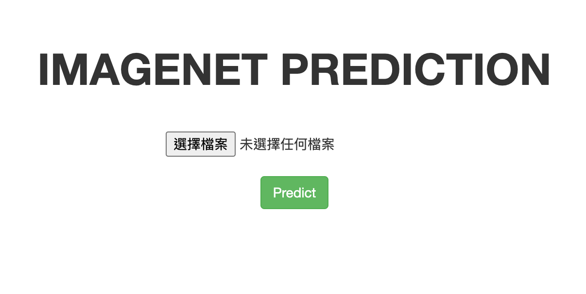
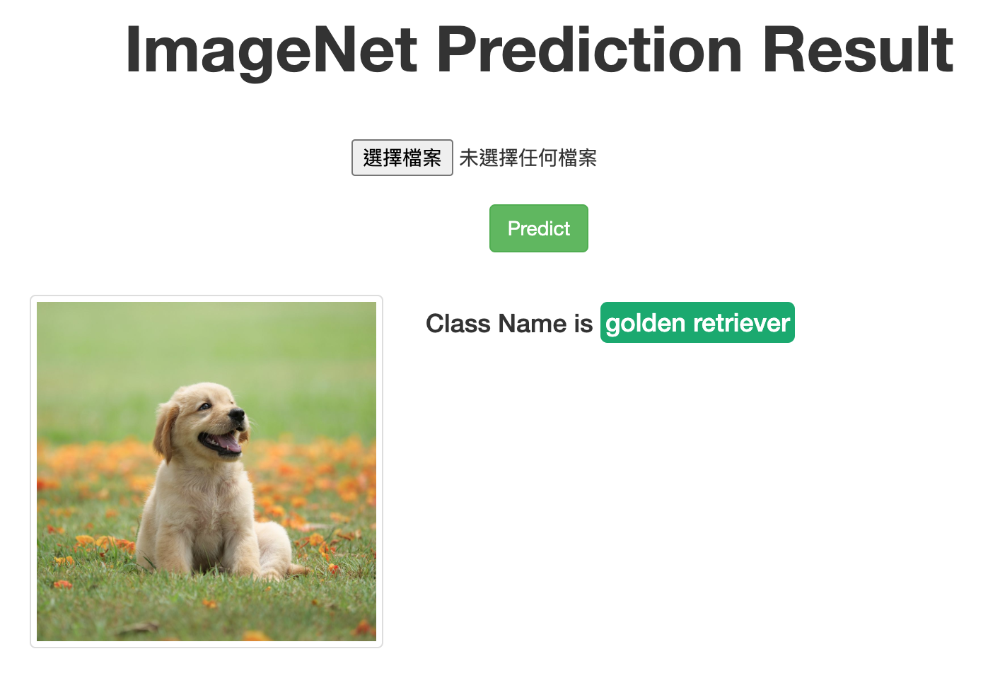
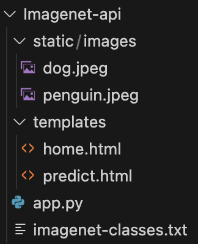
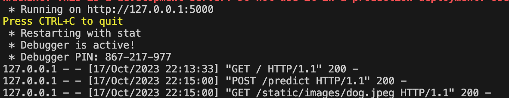

# ImageNet-Recognition-API-with-Flask-in-An-Easy-Way
在「從零開始學Flask」中學到了Flask的基礎知識，而在這個教學中我們將會應用這些知識。我學習Flask最主要的原因就是希望能夠將深度學習模型與API串接在一起，來達到更多的應用。這也是現在許多公司認為應該要有的技能，因此這個教學中我們會學習將深度學習模型串接API，來建立一個用來辨識的API。

我是根據[Deploying Deep Learning Model using Flask API](https://medium.com/@draj0718/deploying-deep-learning-model-using-flask-api-810047f090ac)這篇文章進行修改。由於我習慣用pytorch，但文章內是使用tensorflow，所以我對一些部分進行修改。如果想使用tensorflow可查閱上面那篇文章。

# 說明
建立一個ImageNet的辨識API，模型使用pytorch預訓練好的ResNet50，如下圖所示。

- 執行app.py後，會跳出一個初始網頁
- 上傳照片進行辨識
- 顯示辨識結果

**初始頁面**



**顯示結果**



## About the Model
我是使用PyTorch透過ImageNet預訓練好的ResNet50，這個模型的辨識類別共有1000類，詳細的說明可查閱[相關文件](https://pytorch.org/vision/main/models/generated/torchvision.models.resnet50.html)。由於是使用PyTorch提供的模型，所以可以直接在程式中載入。

## Project Structure


- static資料夾中用來放辨識影像
- templates資料用來放所有html檔
- ```app.py```主要API程式
- ImageNet類別檔

接下來我們會說明```app.py```，再來說明```home.html```與```predict.html```。

## app. py
```app.py```是主要用來建立辨識API的檔案，其中包含一些我們會用到的methods：

- **read_image():** 用來讀取影像，並進行影像前處理。其中包含了```torch.stack```，用來將tensor大小轉為```[batch, 3, 244, 244]```

- **allow_file():** 用來確認影像的副檔名是否為jpg, jpeg, png。
- **homeapge():** 用來呼叫初始頁面（```home.html```），其url設定為```/```
- **predict():** 用來辨識影像的類別，並將辨識結果傳至```predict.html```。
  
## home.html
用來呈現我們辨識API的初始頁面，我們會接收到從user中上傳的input，也就是要辨識的影像。

## predict.html
這是辨識API的result page。當在初始頁面按下```predict```按鈕時，會將影像傳到```app.py```中的```predict()```進行處理及辨識。最後將結果呈現在這個頁面。

## Output Screen
執行```app.py```之後，在terminal或cmd會得到這個```output```



接著複製url，並貼上瀏覽器。接著將影像上傳至初始頁面，並按下```predict```按鈕。模型就會開始進行辨識，最後將結果呈現在頁面上囉！

